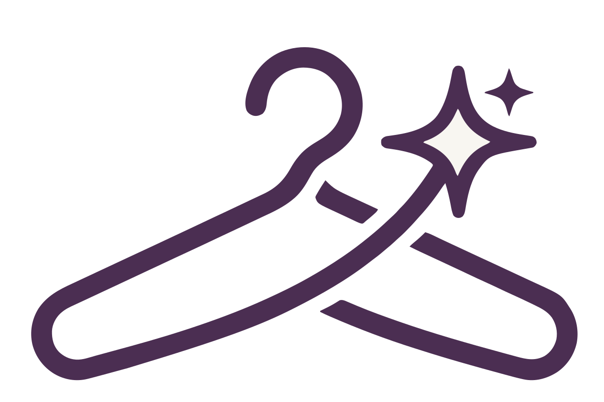

<p align="center">
  <picture>
    <source media="(prefers-color-scheme: dark)" srcset="design/assets/logo-dark.svg">
    
  </picture>
</p>

<p align="center">
  A personal styling agent that recommends outfits from the clothes you actually own.
</p>

<p align="center">
  <a href="https://github.com/fatemenajafi135/what-to-wear/actions/workflows/ci.yml">
    
  </a>
</p>

---

Photograph a garment and it lands in your closet, categorised and colour-matched by a vision
model. Ask *"what should I wear to a dinner on Thursday?"* in plain English and you get real
outfits — assembled only from items in your wardrobe, checked against deterministic coherence
and scoring rules, and explained with citations back to a style knowledge base. Connect a
calendar and it styles for the event that's actually in it, with the weather folded in.

One Next.js codebase serves the desktop web experience and the installed mobile PWA. Routes
are identical across form factors; only the chrome changes.

## What's in the app

| Screen | What it does |
|---|---|
| **Closet** | Browse, filter and page through your wardrobe; open an item, edit it, remove it |
| **Add** | Photograph or upload a garment; a VLM extracts category, colour and attributes into a review card you correct before saving |
| **Recommend** | Conversational styling — talk to the stylist, then get several scored outfit suggestions you can page between, favourite and give feedback on |
| **Outfits** | The gallery of saved outfits, with sort and a detail view |
| **History** | Reopen a past conversation and continue it — the thread resumes where it left off |
| **Calendar** | Connect Google Calendar, see the week ahead, and style for a real event |
| **Profile / settings** | Style preferences, sizes, body shape, account details, theme |

Plus the PWA layer: installable, works offline for what's already cached, and prompts when a
new version is ready. `/dev/components` renders every UI component in every state, in both
themes — the fastest way to see the design system.

## Architecture

```
frontend/ ── Next.js 16 App Router · React 19 · TypeScript · CSS Modules
    │        Supabase Auth (SSR cookies) · Serwist service worker
    │        typed API client generated from the backend's OpenAPI schema
    │
    ├── Supabase ── Postgres (RLS on every table) · Auth · Storage (photos)
    │
    └── backend/ ── FastAPI · SQLAlchemy · uv
             │
             ├── retrieval/ ─ baseline / hybrid / advanced strategies over
             │                Qdrant, with Cohere rerank on the advanced path
             ├── pipeline/  ─ LangGraph graph: query → context → grounded
             │                generation → coherence guards → scoring → citations
             ├── scoring/   ─ pure-Python outfit scorers (no LLM, unit-tested)
             └── eval/      ─ golden sets + judge, run against recorded baselines
```

**The AI layer has rules.** Outfit *scoring* is deterministic Python and never calls an LLM.
On the default grounded path the LLM assembles candidates from an inventory retrieval has
already restricted to items you own; every candidate then passes deterministic coherence
guards and deterministic scorers before it reaches you. There is also an opt-in engine path
where enumeration, scoring and ranking are fully deterministic and the LLM only picks from a
pre-scored top-K and writes the rationale. The knowledge base is layered — L1 colour theory,
L2 colour analysis, L3 trends, L4 dress codes — from the sources listed in
[backend/ATTRIBUTIONS.md](backend/ATTRIBUTIONS.md).

Every LLM and embedding call goes through the Vercel AI Gateway and is traced in LangSmith.

## Repository layout

| Path | Contents |
|---|---|
| [frontend/](frontend/) | Next.js App Router app — web and installed PWA |
| [backend/](backend/) | FastAPI service, AI pipeline, ingestion CLI, eval harness |
| [infra/](infra/) | Local Supabase (migrations, `config.toml`) and the Qdrant compose file |
| [design/](design/) | The design system, the throwaway prototype mockups, brand assets |
| [docs/](docs/) | Design decisions, feature plan, deferred work, deployment runbook, handoffs |
| [specs/](specs/) | Per-slice Spec Kit artifacts — spec, plan, research, tasks, contracts |

## Local development

**Prerequisites:** Docker, [`uv`](https://docs.astral.sh/uv/), Node.js 22+.

```bash
# 1. Local Supabase — Postgres, Auth, Storage; applies every migration to a fresh database
cd infra && npm install && npx supabase start

# 2. Qdrant, for retrieval
docker compose -f infra/docker-compose.yml up -d

# 3. Backend
cd backend && uv sync && cp .env.example .env
uv run uvicorn whattowear.main:app --reload      # http://localhost:8000

# 4. Frontend — fill NEXT_PUBLIC_SUPABASE_ANON_KEY from `npx supabase status`
cd frontend && npm install && cp .env.example .env.local
npm run generate:api-types                        # needs the backend running
npm run dev                                       # http://localhost:3000
```

`curl -s localhost:8000/health` should return `{"status": "ok"}`. If it reports
`unhealthy` with `failed_dependencies: ["database"]`, step 1 isn't running.

`backend/.env.example`'s `DATABASE_URL` is already correct for a stock local stack — note it
points at the **pooler** (port `54329`, user `postgres.pooler-dev`), not the direct port
`supabase status` prints. The AI keys (`AI_GATEWAY_API_KEY`, `COHERE_API_KEY`, `TAVILY_API_KEY`,
`LANGSMITH_API_KEY`) are only needed for the styling paths; everything else runs without them.

To load the knowledge base, point `CORPUS_LOCAL_DIR` at your corpus checkout and run:

```bash
cd backend && uv run python -m whattowear.ingest.cli --corpus-dir ../../w2w-corpus
```

## Tests and checks

```bash
cd backend
uv run pytest                  # unit + integration
uv run ruff check . && uv run ruff format --check .
uv run mypy src
uv run lint-imports            # AI-independence import contract

cd frontend
npm test                       # Vitest
npm run lint && npm run typecheck
npm run e2e                    # Playwright
npm run e2e:pwa                # offline / caching / update-prompt suite
```

Evals are run explicitly, not in CI — they cost money and call real models:

```bash
cd backend
uv run python -m whattowear.eval.harness --strategies advanced --approach grounded
```

Results are compared against the recorded baselines in [docs/eval-baselines/](docs/eval-baselines/).
A refactor of anything in the AI layer needs an eval run showing no regression.

[CI](.github/workflows/ci.yml) runs three jobs on every PR: backend (including a reset of the
database from empty and a zero-environment-variable import check), frontend (including a
staleness check on the generated API types), and the PWA e2e suite.

## Deployment

Staging is Vercel (frontend) + Render (backend, from [render.yaml](render.yaml)) + Supabase +
Qdrant Cloud. [docs/017-deployment-runbook.md](docs/017-deployment-runbook.md) walks the whole
thing from scratch, in order, with the traps called out — 30–60 minutes, mostly waiting for
services to boot.

## Documentation map

Start here, in this order:

- [design/design-system.md](design/design-system.md) — **the visual contract.** Tokens,
  components, states, copy. Nothing visual is invented in code.
- [docs/design-decisions.md](docs/design-decisions.md) — the running decision log. Resolves
  what the design system leaves incomplete or contradicts itself on. Amended forward, never
  rewritten.
- [.specify/memory/constitution.md](.specify/memory/constitution.md) — the ten principles the
  build is held to, and why each exists.
- [docs/feature-plan.md](docs/feature-plan.md) — the slice breakdown and its dependency order.
- [docs/deferred-work.md](docs/deferred-work.md) — decided-and-parked work, so *"we'll come
  back to it"* never quietly becomes *"we forgot."*
- [design/known-gaps.md](design/known-gaps.md) and
  [docs/ios-verification-backlog.md](docs/ios-verification-backlog.md) — what's deliberately
  undecided, and what's blocked on a physical iPhone.

`design/prototype/` is reference only — static mockups, read for intent, never copied from.

## Status

Slices 001–014, 016 and 019–020 have shipped; 017 covers deployment. Two known holes:
**015** (install prompts, permission primers, Apple splash screens) is specified but not
built, and **018** (multi-garment photo-to-items) is parked unmerged after it failed real
end-to-end use — see row 12 of [docs/deferred-work.md](docs/deferred-work.md).

This is a from-scratch rebuild. The prototype it replaced is preserved at the
`prototype-final` tag and on `legacy-main`; neither is deployed, and nothing builds from
them. Their commits appear in `main`'s history as an unrelated second parent, so bound any
bisect: `git bisect start HEAD <a-rebuild-era-commit>`.

## Contributing

- Branches: `feat/###-slug`, `fix/###-slug`, `docs/slug`, `chore/slug`. Code branches off
  `main` and merges back by PR — including during incidents. Docs-only changes can go
  straight to `main`.
- [Conventional Commits](https://www.conventionalcommits.org/) — `feat(012):`, `fix(gh68):`,
  `docs(design):`.
- Never rebase or force-push `main`.
- No secrets in the repo. Commit only `.env.example`.
