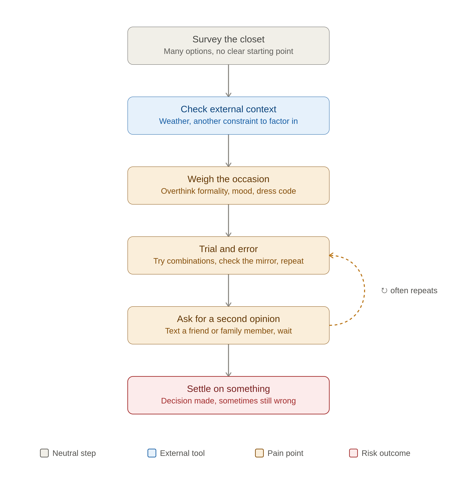
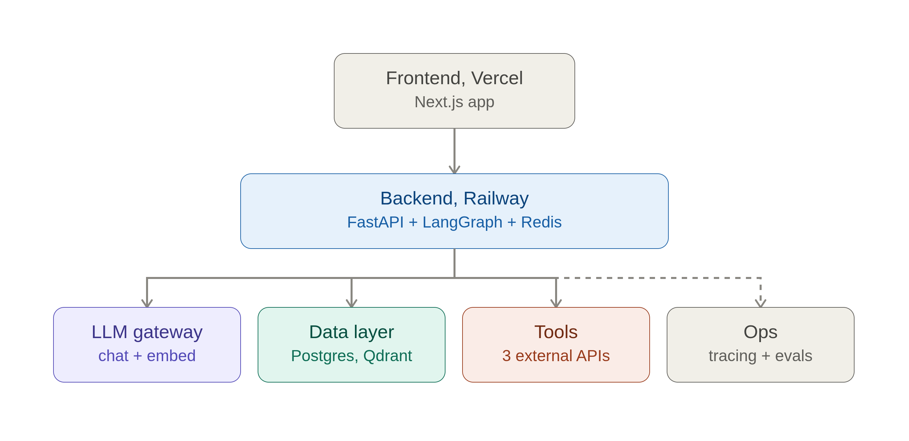
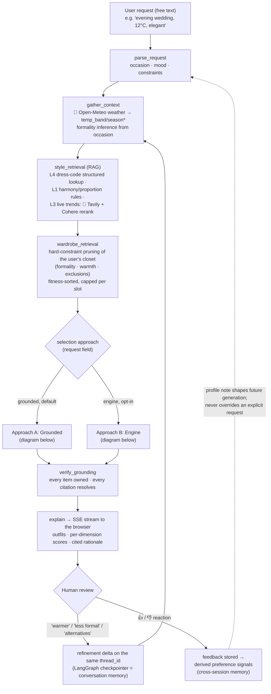
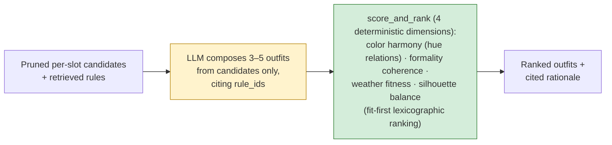
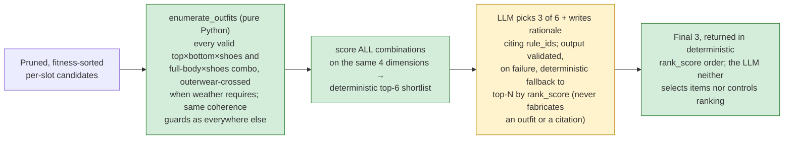

# What to Wear: Certification Challenge Deliverable

This document addresses every deliverable in the Certification Challenge,
task by task, grounded in the actual state of this repository (`backend/` +
`frontend/`) rather than the original plan; where the two diverge, this
reflects what was built and verified. Every number quoted below comes from a
committed artifact under `docs/eval-baselines/`, and every design claim is
traceable to code, a spec under `specs/`, or the project constitution
(`.specify/memory/constitution.md`).

---

## Task 1: Defining Problem, Audience, and Scope

### 1. The problem, in one sentence

> Deciding what to wear each day is a recurring source of wasted time and
> mental fatigue, especially for people who already own enough clothes to
> solve it.

### 2. Why this is a problem for the user

Anyone who dresses from their own closet faces this daily: before picking an
outfit, they have to reconcile several constraints at once: the occasion's
dress code, the weather, the mood or impression they want to convey, and
simple practicality (what's clean, warm enough, appropriate). The task isn't
choosing an outfit, it's finding the one combination, out of everything they
own, that satisfies all of these at the same time, even for something as
routine as a regular workday.

Today, people solve this by mentally cross-checking their closet against each
constraint one at a time: pulling out a few combinations, second-guessing
them, or defaulting to the same "safe" outfits just to skip the decision.
This works, but it's slow and error-prone: it's easy to miss one factor (too
warm, wrong dress code, clashing colors) until it's too late to fix, and
juggling several constraints against a whole closet's worth of options adds
up to real decision fatigue, even for occasions that shouldn't require much
thought.

A general chatbot doesn't solve this either: a user could photograph their
whole closet and paste it into a chat, but they'd have to re-upload and
re-explain everything each time, nothing guarantees the answer only uses
clothes they own, and nothing is remembered. The value of a dedicated system
is the part around the model: the closet is digitized **once** (photo →
attribute extraction → structured record), every suggestion is grounded in
that inventory plus live weather and cited styling rules, and feedback
accumulates instead of evaporating.

### 3. Today's workflow diagram

**Tools/systems involved**: none, other than the closet itself, a mirror, and
a phone used only to text a photo to another person; there is no tool that
actually helps make the decision, only one that outsources it.

**Where it's slow, repetitive, or error-prone** (shaded above): there's no
starting point that narrows the closet before trial-and-error begins; the
occasion-vs-availability step is where hesitation sets in because nothing
has actually been filtered yet; and the mirror → text-a-friend → try-again
loop is the real bottleneck: it's repeated an unpredictable number of times,
depends entirely on someone else's availability and attention, and still
doesn't reliably produce the right outfit at the end.

### 4. Questions / input-output pairs to evaluate the application

These pairs seeded the formal evaluation built for Task 5. They are split
honestly into **(A) pairs that are verified by the current evaluation**
(each row names exactly where it is checked) and **(B) pairs the product is
designed for whose end-to-end verification is planned, not yet claimed**.

**A. Verified by the current evaluation:**

| # | Input (what the user asks) | Expected output (properties, not a fixed outfit) | Where it is verified |
|---|---|---|---|
| 1 | "What should I wear to an evening wedding, it's cold out (12°C)?" | Formal, warm outer layer when required, avoids white/ivory, rationale cites a retrieved rule | Golden cases `g01`/`g17` + harness property checks (`occasion_fit`, `respects_exclusions`, `cites_grounded`) |
| 2 | "Business-casual office look, it's freezing (-3°C)." | Business-casual base, a mandatory warm outer layer, every item actually owned | Golden cases `g03`/`g13` (`requires_outer`, `owned_only`) |
| 3 | "Hot beach day (31°C), feeling relaxed." | Casual, low-warmth pieces only, no outerwear/suits/gowns | Golden case `g06` (`max_warmth`, `forbid_categories`) |
| 4 | "Job interview, cool weather (15°C)." | Business-casual floor, no unnecessary outer layer | Golden cases `g05`/`g18` |
| 5 | "Funeral, cool (10°C)." | Formal and subdued, bright colors explicitly forbidden | Golden case `g10` (`forbid_colors: tomato red, butter yellow, emerald green`) |
| 6 | "Black-tie gala, cold (5°C)." | Black-tie formality actually reached | Golden case `g11` (`min_formality: black_tie`) |
| 7 | Follow-up "warmer" after a suggestion, same conversation | Same occasion preserved; only the warmth floor shifts, not a brand-new request | Integration tests `test_suggest_refinement.py` (warmer raises mean warmth **and** preserves occasion; likewise less-formal and alternatives) |
| 8 | A response referencing anything the closet can't back | **Never an invented item**: ungrounded outfits are dropped, and when few valid combinations exist, fewer honest outfits are returned rather than fabricated ones | Grounding tests (`test_grounding_graph.py`: unowned item dropped, all-bad yields empty) + the engine's validated fallback test; observed in practice on 5/24 sparse cases in `docs/eval-baselines/010-engine/COMPARISON.md`; `owned_only` = 1.00 and 0 hallucinated items on every committed run |

**B. Designed and implemented, end-to-end verification planned (not yet
claimed):**

| # | Input | Designed behavior | Current verification status |
|---|---|---|---|
| 9 | A photo of a navy top, uploaded to the closet | Extracted category=top with plausible formality/warmth ranges, reviewed by the user before saving | The extraction flow and the user-review step are implemented and in production; the dedicated vision golden set currently holds 2 **synthetic placeholder** images and is explicitly flagged as not yet sufficient for an accuracy claim; building a real-photo set is Task 7 work |
| 10 | "Suggest something," then rejecting it as "too much green" | A later, similar request avoids green without being told again | The full mechanism is implemented and wiring-tested: reactions are stored, distilled into net-liked/net-rejected color and category signals, and delivered to generation as a profile note, with a test guaranteeing a learned preference can never override an explicit request. What is deliberately **not** yet asserted is the final step (the LLM reliably honoring the note end-to-end), because that is non-deterministic; making it deterministic (a preference *scoring dimension* plus a rethink golden case) is Task 7 work |

---

## Task 2: Propose a Solution

### 1. The solution, in one sentence

> What to Wear is an AI stylist that assembles complete outfits only from
> clothes a user already owns, grounding every suggestion in retrieved
> professional styling rules and citing them, so getting dressed for any
> occasion takes one request instead of a mirror-and-friend loop.

### 2. Infrastructure diagram

**Why each component:**

| Component | Choice | Why |
|---|---|---|
| **LLM** | `openai/gpt-5.4-mini`, called via the Vercel AI Gateway | Strong structured-output support at low per-request cost, which matters because a single suggestion makes several LLM calls (intent parsing implicitly via context assembly, outfit generation, rationale) |
| **Agent orchestration framework** | LangGraph (`StateGraph`) | Its built-in per-`thread_id` checkpointing is the entire mechanism conversational refinement ("warmer") runs on, and it gives a node-by-node trace for free |
| **Tool(s)** | Tavily (live trend search) + Open-Meteo (live weather) | Both are called as ordinary deterministic tool functions from graph nodes rather than LLM-invoked function-calling, because *which* layers to query is a fixed routing rule (Constitution Principle III), not something worth letting an LLM decide |
| **Embedding model** | `openai/text-embedding-3-small` | A solid quality/cost balance for a modest ~391-chunk corpus; no need for a larger embedding model at this scale |
| **Vector Database** | Qdrant (Cloud) | First-class hybrid dense-similarity **and** payload-metadata filtering in one store: exactly what the KB's structured-filter / load-all / dense-search split needs |
| **Monitoring tool** | LangSmith | Tracing is made *mandatory* in `config.py` (the app refuses to start without a key), so every real request gets a full per-node, per-call trace, the actual way to audit "why did it pick that" |
| **Evaluation framework** | A custom two-part harness: in-package deterministic checks + an isolated RAGAS/openevals project | Core grounding claims (owned-items-only, cites real rules) need to be verified *mechanically*, not judged, while retrieval and answer quality still benefit from RAGAS's and an LLM-judge's fuzzier metrics |
| **User interface** | Next.js (App Router) on Vercel | One deployable that satisfies "runs on my phone and laptop in a browser," with a fast CDN for static assets, for free |
| **Deployment tool** | Railway (backend + Redis) + Vercel (frontend) + Supabase (Postgres/Auth/Storage) | The minimum set of managed services covering compute, cache, relational data, auth, and file storage without hand-operating any infrastructure |
| **Other: reranker** | Cohere `rerank-v4.0-fast` | A cheap second-stage precision boost applied only to the one genuinely similarity-searched retrieval layer (current trends); the structured layers have nothing for a reranker to improve |
| **Other: LLM routing** | LiteLLM (`langchain-litellm`'s `ChatLiteLLM`), sitting between LangChain and the gateway | Automatic same-provider retry on transient failures and LangSmith-visible cost/usage, without standing up a separate routing service |

### 3. Agent workflow diagram

The application supports **two selection approaches over one shared graph**
(`approach` field on `POST /suggest`): the original **grounded** path, where
the LLM composes outfits from pre-pruned candidates, and the **engine** path
(added as Task 6's second improvement, below), where item selection and
ranking are fully deterministic and the LLM only chooses which of an
already-scored shortlist to surface and writes the rationale.

**Everything drawn in this section is implemented and tested on `main`**:
the shared spine, both selection approaches, the refinement loop, and the
feedback-to-preferences memory. Planned extensions (an approach selector in
the UI, in-turn rethink from a rejection reason, an agentic tool-router
variant, a side-by-side compare mode) are deliberately *not* drawn here;
they are listed in Task 7.

**The shared workflow (both approaches):**

\* The weather tool is implemented and exercised by the evaluation harness;
the deployed UI does not yet collect a location/date, so surfacing it on
every real request is Task 7 item 2, stated here rather than discovered.

**Approach A, Grounded (default): the LLM composes, deterministic code
scores and ranks:**

**Approach B, Engine (opt-in): deterministic code selects *and* ranks, the
LLM only curates and explains (constitution Principle II):**

**How the application solves the user's problem, end to end.** A request
like "evening wedding, cold" is parsed and enriched with live context: the
weather tool converts a location/temperature into the `temp_band` and
`season` that gate garment eligibility, and the occasion is mapped to a
formality floor. Retrieval then runs per knowledge layer: an exact
structured lookup for dress-code and weather-eligibility cards (these are
constraints, so they must never be "approximately" retrieved), plus dense
search over harmony/proportion rules, plus a live Tavily-refreshed,
Cohere-reranked trend layer. Only then is the user's closet touched: items
that violate the retrieved constraints are pruned before any generation
happens (Constitution Principle III: style knowledge *gates* wardrobe
retrieval). On the default path the LLM assembles candidate outfits from
that pre-approved pool and cites the rules it relied on; on the engine path
the system instead enumerates every valid combination, scores all of them on
four deterministic dimensions, and the LLM only selects from and explains a
pre-scored shortlist. Either way, output passes a grounding verifier that
mechanically confirms every item is owned and every citation resolves to a
real rule before anything is streamed to the browser.

**Memory and human review are built into the loop twice.** Within a
conversation, LangGraph's per-`thread_id` checkpointer means "warmer" or
"less formal" is applied as a delta to the original request rather than a
brand-new query. Across conversations, the like/reject reaction on every
suggested outfit is stored and distilled into preference signals (net-liked
and net-rejected colors/categories, formality drift) that shape future
suggestions. The photo-upload flow has its own human-approval step: VLM
extraction is shown to the user for review and correction *before* an item
is saved to the closet.

**Requirements check**: LLM gateway: Vercel AI Gateway via LiteLLM;
memory component: checkpointer (in-conversation) + stored feedback →
derived preferences (cross-session); runs in a browser on phone and laptop:
Next.js on Vercel against the deployed FastAPI backend.

---

## Task 3: Dealing with the Data

### 1. Default chunking strategy, and why

The project uses **two chunking strategies, chosen per source type**, not
one universal splitter, because the two kinds of source content genuinely
need different treatment:

- **`atomic`** (the default for hand-authored/distilled content such as
  dress-code definitions, weather-eligibility cards, harmony/proportion
  rules, trend cards): each document is already a single, self-contained
  rule, so it's kept as one chunk verbatim, with its `rule_id` preserved.
  This is what makes metadata filtering exact and citations stable: a rule
  can always be traced back to precisely the concept it states.
- **`section`** (the default for long-form prose, such as Wikipedia articles
  and two public-domain color-theory books): a
  `RecursiveCharacterTextSplitter` at a 900-character chunk size with
  120-character overlap, using header-aware separators first. This avoids
  the "whole-article mush" problem of embedding a full article as one
  vector, while staying free and offline (no per-chunk API cost, unlike the
  semantic-chunking alternative the codebase also implements but
  deliberately never runs by default, since it costs an embedding call per
  sentence).

**Why this split**: rules that already exist as one atomic idea shouldn't be
artificially fragmented: doing so would only add noise and break precise
citation. Long-form prose, by contrast, has no natural atomic unit small
enough to embed usefully, so it needs real splitting. The resulting
chunk-size heterogeneity between the two source types is accepted
deliberately and measured directly (Task 6's chunk-size experiment below)
rather than papered over with one compromise size for everything.

### 2. Data sources and external APIs, and how they interact

**Personal data (the user's own closet).** Wardrobe items live in Supabase
Postgres, one structured record per garment (category, group, colors as hex,
formality, warmth, season, fabric, pattern, fit) plus a photo in Supabase
Storage. Items enter the closet through a photo-upload flow: a VLM
extraction pass proposes attributes from the photo, and the user reviews and
corrects them before saving, so the structured closet stays trustworthy
enough to prune and score against. This is the RAG corpus that matters most:
**every suggestion is retrieval over the user's own inventory first.**

**Style knowledge base (391 chunks in Qdrant), four layers:**
- **L1, styling rules**: hand-authored atomic cards for color harmony and
  proportion (`data/kb/l1_rules.jsonl`), plus section-chunked prose from
  three public-domain/owned sources (*A Color Notation*, Munsell; *The Laws
  of Contrast of Colour*, Chevreul; *The Curated Closet*, Rees) and six
  Wikipedia articles (color theory, color analysis, complementary colors,
  harmony, dress codes, 2020s fashion).
- **L3, current trends**: distilled trend cards
  (`data/kb/l3_trend_cards.jsonl`), refreshable live via **Tavily** (external
  API #2) with a distillation prompt that forbids copying source text; this
  is the one genuinely similarity-searched layer, so it is the layer the
  Cohere reranker is applied to.
- **L4, dress codes & weather eligibility**: atomic constraint cards
  (`data/kb/l4_dresscodes.jsonl`) retrieved by **exact structured lookup**,
  never similarity: a black-tie definition retrieved "approximately" would
  be a correctness bug, not a relevance miss.

**External APIs and their role at request time:**
- **Open-Meteo** (external API #1, keyless): geocodes a location and returns
  temperature + condition, which the context assembler converts to the
  `temp_band` and `season` that (a) gate L4 eligibility rules, (b) drive the
  deterministic weather-fitness scoring dimension, and (c) decide whether an
  outer layer is mandatory.
- **Tavily** (external API #2): refreshes the L3 trend cards from live
  fashion coverage, so "what's current" doesn't freeze at ingest time.

**How they interact during usage**: weather context arrives first and
parameterizes retrieval; retrieval (L4 constraints + L1 rules + reranked L3
trends) produces the rule set; that rule set prunes the closet; and only the
pruned, rule-approved closet reaches selection, so by construction, the
personal data and the public knowledge meet *before* the LLM is involved,
not after.

---

## Task 4: Building an End-to-End Agentic RAG Prototype

### 1. Build

An end-to-end prototype is built and running: a FastAPI backend
(`backend/src/whattowear/`) implementing the full retrieval → generation →
scoring → grounding graph above behind `POST /suggest` (SSE), plus a Next.js
frontend (`frontend/`) covering sign-in/sign-up, add-item-by-photo (VLM
extraction with a user review/edit step before saving), closet view, and
free-text outfit suggestions with conversational refinement and a
like/reject reaction affordance.

### 2. Deploy

The prototype is deployed to public endpoints:

- **Backend**: FastAPI container on **Railway**, with `GET /health`
  checking live Postgres + Qdrant reachability (`503` naming the failed
  dependency if either is down, rather than a static `200 ok`).
- **Frontend**: Next.js on **Vercel**.
- **Data/auth/storage**: Supabase (Postgres, Auth, Storage bucket for
  wardrobe photos).

> **Live URLs**: provided in the submission form.

---

## Task 5: Evals

### 1. Test data set

`backend/data/golden_set.yaml`: **24 hand-authored `(occasion, mood,
weather)` cases**, each with **expected outfit PROPERTIES, not a fixed
outfit** (an outfit problem legitimately has many right answers). Each case
specifies: a minimum formality floor, warmth constraints (a required outer
layer in cold weather, or a warmth ceiling in hot weather), forbidden
colors/categories where applicable, the specific `rule_id`s retrieval is
expected to surface (for retrieval recall), and a short reference answer
(for RAGAS). A second, independent **vision golden set** (`vision_cases`,
currently 2 samples, flagged in its own README as synthetic placeholder
images, not real garment photos, and explicitly not yet trusted for a real
accuracy claim) checks the photo→attribute extraction path with loose
expected ranges instead of hard constraints, since extraction is inherently
less precise than a closed-form rule check.

### 2. Evaluation harness

A **two-part harness**, matching the project's own deterministic-vs-fuzzy
split:

**Part 1, deterministic property checks** (`src/whattowear/eval/harness.py`,
in-package, runs the real pipeline end-to-end per golden case and writes
per-case JSONL artifacts). Checks per response: `owned_only` (every
suggested item resolves to the caller's actual closet, the hallucination
check), `cites_grounded` (every citation resolves to a real KB rule),
`every_choice_cites`, `weather_appropriate`, `occasion_fit` (formality floor
met), `respects_exclusions` (forbidden colors/categories honored),
`outfit_count_in_range`, `all_have_four_scores`, `ranked_descending`, plus
`retrieval_recall` against each case's expected `rule_id`s. The harness
supports `--strategies {baseline,hybrid,advanced}` (retrieval comparison,
Task 6.2) and `--approach {grounded,engine}` (selection-approach comparison,
Task 6.3), writing distinct artifacts per configuration so runs never
clobber each other. Durable snapshots of the runs quoted in this document
are committed under `docs/eval-baselines/`.

**Part 2, RAGAS + LLM-as-judge** (`backend/evals/`, an isolated project
because the RAGAS dependency pins conflict with the retrieval stack):
`score_ragas.py` computes retrieval-quality metrics (context precision /
recall against each case's reference answer) and `judge.py` runs a prompted
LLM judge over the generated rationales, each writing a per-run summary CSV
(`ragas_summary.csv` / `judge_summary.csv`; run instructions in
`notebooks/03_eval_harness_and_conclusions.ipynb`). Because these metrics
are LLM-scored and drift run-to-run, they are treated as per-run
*complements* to the harness, not as the regression gate: the deterministic
Part-1 checks are the gate, and **every number quoted in this document comes
from Part 1's committed, reproducible snapshots under
`docs/eval-baselines/`**, a deliberate choice to rest graded claims only on
metrics that are mechanically verifiable and preserved in the repository.

### 3. Conclusions from the evaluation

**The grounding guarantees hold, mechanically, everywhere.** Across every
committed run (all three retrieval strategies and both selection
approaches), `owned_only` is 1.00 and `hallucinated_items` is 0. The
system's central promise (it never dresses you in clothes you don't own)
is verified, not asserted.

**Evaluation caught a scorer measuring the wrong construct.** The original
color-harmony dimension scored outfits by average pairwise **WCAG contrast
ratio** (an accessibility metric), normalized so *more contrast scored
higher*. That is close to the opposite of color harmony: navy + charcoal
(tonal, elegant) scored low, while tomato red + emerald green (a clash)
scored high, and the equal-weighted ranking let this broken dimension push
clashing outfits to the top. The fix (feature `009-scoring-fixes`) replaced
it with hue-relationship classification in HSL grounded in the KB's own
color-theory rules (neutral-anchored, analogous, complementary-with-
dominance, too-many-saturated-hues), with the fired rule named in each
score's reason. Concrete before/after on the same pairs
(`docs/eval-baselines/pre-009/COMPARISON.md`): navy+charcoal now scores
**0.9** ("neutral-anchored, L1-color-neutral-anchor") vs tomato+emerald
**0.4**, more than double, in the correct direction, with a citeable
reason. Two companion fixes landed in the same feature: ranking now uses a
fit-first lexicographic strategy (weather/formality dominate; color and
silhouette break ties), and per-slot candidate truncation is
fitness-sorted first, so the best-fitting items can no longer be silently
dropped before selection. The full pre/post no-regression comparison is
committed (`pre-009` vs `post-009`): retrieval recall byte-identical,
grounding unaffected.

**Retrieval structure, not similarity tuning, is what moved recall**; see
Task 6's table. And **the deterministic-selection approach measurably
improves the dimension it was designed to improve**: `weather_appropriate`
0.83 → 0.92 and mean top outfit `rank_score` 782.7 → 798.7 (grounded vs
engine, same golden set, same closet, same commit:
`docs/eval-baselines/010-engine/COMPARISON.md`).

**Honest limitations the harness surfaced.** On 5/24 sparse-candidate cases
the engine's shortlist held fewer than 3 valid combinations, so its
validated fallback returned 1–2 deterministically-ranked outfits with
deliberately empty citations rather than fabricating either, which the
`every_choice_cites` / `outfit_count_in_range` metrics (written before the
fallback existed) can only read as failures. The tracing of those 0.79s to
this exact root cause, and the follow-up (teach the harness to recognize a
flagged fallback as a distinct intentional case), are documented in the
committed comparison. Separately, generation-dependent metrics drift
run-to-run with LLM sampling; single-run deltas on those are treated as
directional only, and the deterministic metrics (`retrieval_recall`,
`owned_only`) are the regression gate.

---

## Task 6: Improving Your Prototype

### 1. Advanced retrieval technique, and why

Two techniques beyond naive dense retrieval, applied where each actually
helps:

- **Per-layer hybrid retrieval**: exact structured/metadata lookup for the
  constraint layers (L4 dress codes and weather eligibility; atomic L1
  rules) combined with dense search only where similarity is genuinely the
  right tool. Rationale: dress codes and weather rules are *constraints*;
  retrieving them by embedding similarity risks missing the exact rule that
  makes an outfit wrong, which is a correctness failure, not a relevance
  miss.
- **Cohere rerank (`rerank-v4.0-fast`)** as a second-stage precision boost
  on the L3 live-trend layer, the one layer that is truly
  similarity-searched over fuzzy, changing content, and therefore the one
  layer where a cross-encoder reranker has signal to add.

### 2. Comparison table (baseline → advanced)

Full golden set (24 cases), committed run (`docs/eval-baselines/post-009/`):

| metric | baseline (naive dense) | hybrid (per-layer) | advanced (hybrid + rerank) |
|---|---:|---:|---:|
| **retrieval_recall** (vs expected rule_ids) | **0.792** | **0.944** | **0.944** |
| owned_only | 1.00 | 1.00 | 1.00 |
| cites_grounded | 1.00 | 0.96 | 0.92 |
| occasion_fit | 1.00 | 1.00 | 1.00 |
| respects_exclusions | 1.00 | 1.00 | 1.00 |
| weather_appropriate | 0.92 | 0.88 | 0.88 |

Read honestly: **the +0.15 recall jump comes from the hybrid structure**:
the exact L4/L1 lookups retrieve the constraint rules the naive dense
baseline misses. Rerank does not move recall further, and we don't claim it
does: its contribution is *precision within the L3 trend layer* (better
ordering of fuzzy trend chunks), which recall-against-rule-ids cannot see;
the qualitative difference is shown in
`notebooks/02_retrieval_baseline_vs_advanced.ipynb`. Small movements in the
generation-dependent rows are within documented run-to-run LLM-sampling
noise and are not claimed as effects.

**A second "change one variable" retrieval experiment with an honestly flat
result**: rebuilding the KB at section chunk sizes 500 / 900 / 1500 leaves
retrieval recall identical, because this golden set's expected rules are
almost entirely atomic cards (L4 + atomic L1), which no section splitter
touches. The experiment is kept (same notebook) as evidence that the metric
is measured rather than assumed; it also motivated keeping recall-relevant
knowledge in atomic, precisely-citeable cards.

### 3. A second, independently-verified improvement: deterministic selection ("engine")

**What changed.** The original pipeline let the LLM assemble outfit
combinations from pre-pruned candidates. Feature `010-engine` added a second
selection approach in which **item selection and ranking are pure Python**:
enumerate every valid combination from the pruned per-slot candidates
(top×bottom×footwear and full-body×footwear tracks, outerwear-crossed when
the weather demands it, all filtered through the same coherence guards as
the rest of the system), score *all* of them on the four deterministic
dimensions, and hand the LLM a pre-scored top-6 shortlist from which it may
only choose which 3 to surface and write the cited rationale, with results
returned in deterministic `rank_score` order and a validated fallback to
top-N-by-score if the LLM's output fails checks. This also brought the
default-selection path of the project constitution's Principle II
("the LLM must not select clothing items") from aspiration to verified
behavior: on the engine path the LLM neither proposes combinations nor
controls the final ranking.

**Hard evidence** (24 golden cases, same closet, same commit, retrieval held
constant at `advanced`: `docs/eval-baselines/010-engine/COMPARISON.md`):

| metric | grounded (LLM composes) | engine (deterministic) |
|---|---:|---:|
| weather_appropriate | 0.83 | **0.92** |
| top outfit mean rank_score | 782.74 | **798.65** |
| owned_only | 1.00 | 1.00 |
| cites_grounded | 1.00 | 1.00 |
| occasion_fit | 1.00 | 1.00 |
| hallucinated items | 0 | 0 |

The two engine metrics that read lower (`every_choice_cites` 0.79,
`outfit_count_in_range` 0.79) were both traced to the *same* 5
sparse-candidate cases where the fallback correctly returned fewer outfits
with deliberately empty citations instead of fabricating either, a
designed honesty behavior that predates the harness's ability to recognize
it (full root-cause analysis in the committed comparison). The meaningful
result: on the dimension deterministic selection was built to improve, it
improves: warmth-appropriate outfits reach the user more often because
weather fitness shapes which combinations exist at all, rather than relying
on the LLM to reason about warmth while also inventing the combination.

---

## Task 7: Next Steps

**Keep for Demo Day.** The four-layer KB with per-layer retrieval, the
grounding verifier, the deterministic scoring dimensions with citeable
reasons, the golden-set + two-part harness (it caught a real inverted-metric
bug, it has earned its place), conversational refinement on the
checkpointer, the photo→review→save closet flow, and the engine selection
path, which should become the default once the sparse-shortlist behavior
below is addressed.

**Change or improve, in priority order:**
1. **Surface the approach choice in the UI** (the API already accepts
   `approach`) and mark fallback-produced outfits with an explicit flag:
   one field that fixes two harness metric blind spots and gives the UI an
   honest "chosen by deterministic ranking" label.
2. **Activate weather end-to-end in the product**: the backend's Open-Meteo
   integration is exercised by the eval harness, but the frontend currently
   sends only the occasion text; adding a small "when & where" input (and
   later, a calendar connection that fills the same context fields) makes
   live weather shape every real request, not just evaluated ones.
3. **Human-in-the-loop rethink**: reactions are already stored and distilled
   into preference signals; the next step is closing the loop in-turn: a
   👎 with a reason ("colors clash", "too formal", per-item ✕) becoming an
   immediate deterministic delta (exclude the combination, adjust the
   ranking weights) on the same thread, which the engine can re-run in
   milliseconds, plus a fifth scoring dimension that applies the derived
   preference signals mathematically rather than as a prompt note.
4. **Distilled rule cards from the book corpus**: an extraction pass turning
   section-chunked prose into additional atomic, citeable rule cards; the
   chunk-size experiment showed atomic cards are what recall actually runs
   on, so growing that layer is the highest-leverage KB work.
5. **An agentic router variant** (LLM chooses which tools/layers a request
   needs, with a critic-veto loop over the engine's shortlist) and a
   **compare mode** running approaches side-by-side, logging the user's pick
   as a live pairwise preference, turning real usage into evaluation data.
6. **Vision-path hardening**: replace the placeholder vision golden set with
   real garment photos before claiming extraction accuracy.
